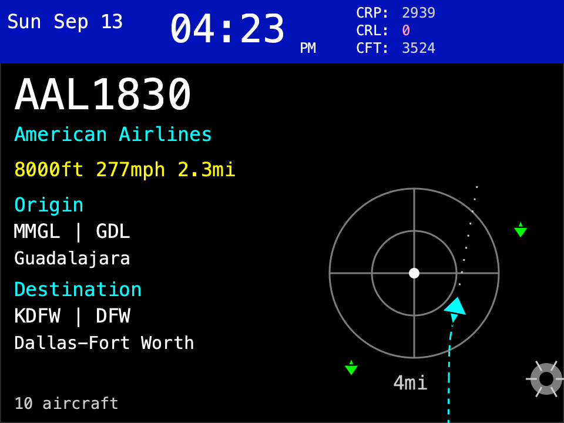
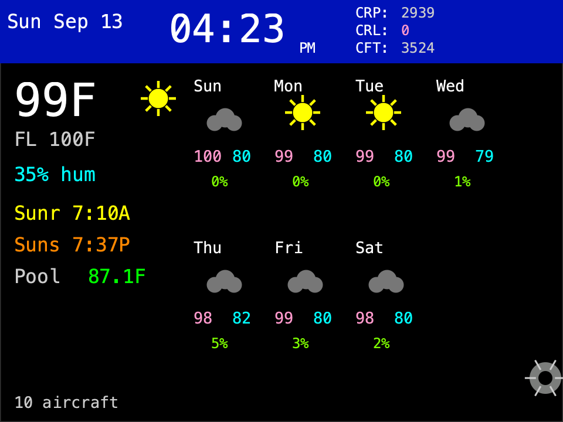
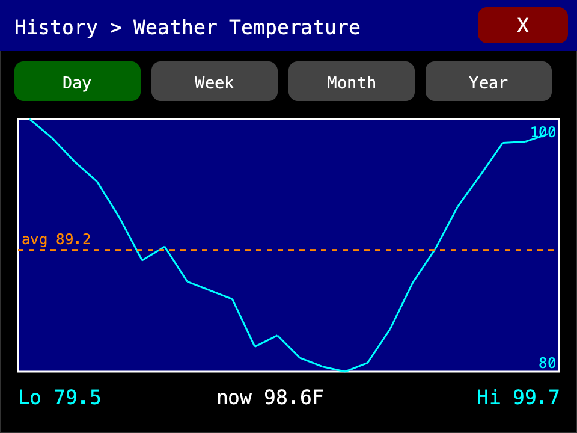
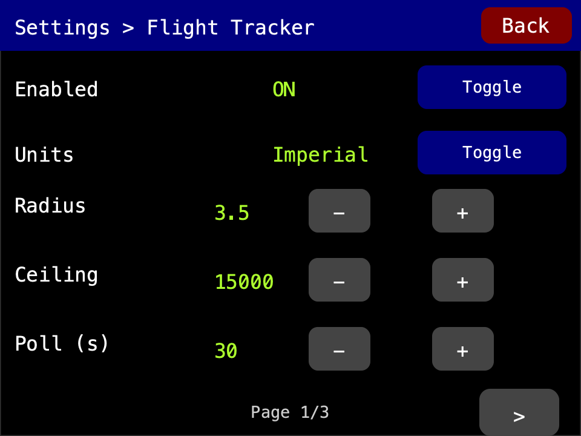

# cyd-dashboard — User Guide

A small self-contained touchscreen dashboard for the **Cheap Yellow Display**
(ESP32-2432S028R). Once it's set up it runs on your WiFi — no computer needed.

## What it shows

- **Clock & date** — always on top.
- **Weather** — current temperature, feels-like, humidity, sunrise/sunset, a
  7-day forecast, and temperature history graphs (Day / Week / Month / Year).
- **Flights overhead** *(optional — on by default)* — a mini radar of live
  aircraft near you: callsign, route, altitude, speed, distance, airline logo,
  and the plane's actual ground track.
- **Pool temperature** *(optional — off by default)* — current water
  temperature and history graphs, if you have a Govee pool thermometer.
- **Sleep mode** — the screen sleeps overnight and wakes on touch.
- **Self-updates** — new firmware installs itself over WiFi.

## First-time setup

1. **Plug it in.** On a brand-new device (or after a Factory Reset) it first
   asks you to tap a few crosshairs to calibrate the touchscreen — this is
   skipped if calibration is already saved.
2. **Enter WiFi.** Type your network name and password on the on-screen
   keyboard. (Change it later under **Settings → Network**.)
3. Done — the dashboard appears and starts loading weather and flights.

## Set your location

Weather and flights need to know where you are. On first boot the device
guesses your location from your internet connection — check that it's right:

Open **Settings → Location**, then use whichever is easiest:

- **Search Address** — type your city or address and pick the match.
- **Set** — type your latitude and longitude directly.
- **Find by IP** — guess again from your connection.

## OpenSky API key (recommended)

Flights work out of the box, but a free OpenSky account raises your daily
limit and removes the yellow "anonymous" warning.

1. Create a free account at **opensky-network.org**.
2. Go to **My OpenSky → Account** and create an **API client**. You'll get a
   **client ID** and a **client secret**.
3. On the device: open **Settings → Flight Tracker**, page right to the
   **OpenSky Credentials** screen, and enter both.

The three small readouts in the header — **CRP**, **CRL**, **CFT** — show
your remaining daily OpenSky credits (tap them for detail). Grey is healthy,
yellow is low, pink is nearly out. Credits reset daily.

## Govee pool thermometer (optional)

Only if you own a Govee pool thermometer:

1. Create a free developer account at **developer.govee.com** and generate an
   **API key**.
2. On the device: open **Settings → Pool Temp**, turn it **on**, enter the
   key, tap **Fetch Devices**, and pick your thermometer.

<!-- PAGEBREAK -->

## Using the dashboard

- **Cog (bottom-right)** — open settings.
- **Weather temperature (top-left)** — weather history graph.
- **Pool reading** — pool temperature history graph.
- **Aircraft count (bottom-left)** — details of the last overhead flight.
- **CRP / CRL / CFT (header)** — OpenSky credits detail.
- Any settings or graph screen returns to the dashboard after 2 minutes
  untouched.

The idle dashboard, the temperature graph, and Flight Tracker settings:

## Settings at a glance

Defaults shown in parentheses.

- **General** — clock color (blue); auto-update (on).
- **Location** — your coordinates (auto-guessed on first boot).
- **Network** — WiFi network; DHCP or static IP; device hostname.
- **Flight Tracker** — enabled (on); units (imperial); radar radius (3.5 mi);
  altitude ceiling (15,000 ft); poll interval (30 s); timer bar (off); home
  airport (none); watched callsign (none); LED blink (on); Show IATA (on);
  OpenSky credentials.
- **Sleep Mode** — enabled (on); sleeps 10:00 PM – 8:00 AM; a touch wakes it
  for 5 minutes.
- **Pool Temp** — (off) enable, enter the API key, pick your thermometer.
- **Calibrate Touch** — rerun touch calibration.
- **About** — version, author, and firmware update status / install.
- **Reset** — see *Resetting* below.

## Resetting (Settings → Reset)

Every option asks you to confirm and says exactly what it clears:

- **Restart** — reboots only; clears nothing.
- **Graph Data** — clears pool and weather temperature history.
- **Settings** — clears settings and credentials (keeps touch calibration).
- **Factory Reset** — clears *everything*: settings, credentials, files,
  history, and touch calibration. The next boot recalibrates touch and asks
  for WiFi again. **Warning:** if the device came pre-loaded with airline
  logos, they are erased — restoring them requires reloading them from a
  computer.
- **Cancel** — backs out without changing anything.

## LED & border colors

- **Red border / LED** — something needs attention: no WiFi, bad OpenSky
  credentials, exhausted OpenSky credits, or missing weather/pool data.
- **Yellow** — OpenSky is running anonymously; flights still work.
- **Flight blinks** — blue for any overhead flight; red when it's departing
  your home airport; green when arriving; yellow when both ends are your home
  airport; white for your watched callsign.

## Updates

The device updates itself over WiFi. **Auto-Update** (on by default) checks
once a day; or open **Settings → About** and tap **Install** when a newer
version is offered. If an update fails to start, it rolls back automatically.

## Troubleshooting

- **Taps land in the wrong spot** — press and hold anywhere on the screen for
  **10 seconds** to recalibrate.
- **Wrong weather or no flights nearby** — fix your location under
  **Settings → Location**.
- **New WiFi network** — re-enter it under **Settings → Network**.

<em>Source: <a href="https://github.com/improving-minnesota/cyd-dashboard">github.com/improving-minnesota/cyd-dashboard</a> — see README.md for the full guide.</em>

